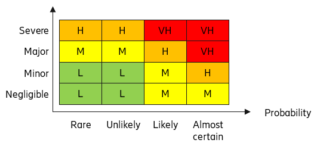

Executive Summary

**Assessment target:** \[eric-oss-flow-automation\] \[Release\]

**Assessment period:** \[2022-07-12\] -- \[2022-09-28\]

Security Risk and Privacy Impact Assessment was performed in workshops
on 2022-09-27. The workshops were led by Jia Zheng Gan and the product
was presented by Jia Zheng Gan. Workshop participants are listed in 1.1.

Security level is **Excellent.**

Privacy level is **Excellent.**

The table below summarizes the number of residual risks:

| SUMMARY |    Risks |    with privacy impact    |
|---|---|---|
| Very High |    2 |  |
| High  |    1 |  |
| Medium |    1 |  |
| Low |  |  |
| Total |   4    |    0    |

Highest risks are related to:

-   [N/A, Service Mesh is a 2pp handled by eric-mesh-controller and eric-mesh-proxy\]

Most important treatment actions and recommendations to lower the risks
are:

-   \[N/A\]

Contents

[1 General Information](#1-general-information)

&ensp;[1.1 Participants](#11-participants)

&ensp;[1.2 Distribution](#12-distribution)

&ensp;[1.3 Scope](#13-scope)

&ensp;&ensp;[1.3.1 Included](#131-included)

&ensp;&ensp;[1.3.2 Excluded](#132-excluded)

&ensp;[1.4 Overview](#14-overview)

&ensp;[1.5 Compliance to basic RA and PIA activities](#15-compliance-to-basic-ra-and-pia-activities)

&ensp;[1.6 Additional Remarks](#16-additional-remarks)

[2 RA and PIA Activities and Their Outcomes](#2-ra-and-pia-activities-and-their-outcomes)

&ensp;[2.1 Data Flow Diagrams](#21-data-flow-diagrams)

&ensp;[2.2 Assets](#22-assets)

&ensp;&ensp;[2.2.1 Security Assets](#221-security-assets)

&ensp;&ensp;[2.2.2 Personal Data](#222-personal-data)

&ensp;[2.3 Threat Agents](#23-threat-agents)

&ensp;[2.4 Existing Security and Privacy Controls](#24-existing-security-and-privacy-controls)

&ensp;[2.5 Security and Privacy Assumptions](#25-security-and-privacy-assumptions)

&ensp;[2.6 Threat Modeling](#26-threat-modeling)

&ensp;[2.7 Risks from Security and Privacy Requirements](#27-risks-from-security-and-privacy-requirements)

&ensp;&ensp;[2.7.1 Generic Security Requirements](#271-generic-security-requirements)

&ensp;&ensp;[2.7.2 Generic Privacy Requirements](#272-generic-privacy-requirements)

&ensp;[2.8 Risks from 2PP, 3PP and FOSS](#28-risks-from-2pp-3pp-and-foss)

&ensp;&ensp;[2.8.1 Risks Related to Data Protection Agreements with 3PP](#281-risks-related-to-data-protection-agreements-with-3pp)

&ensp;[2.9 Risks Related to Misuse of Personal Data](#29-risks-related-to-misuse-of-personal-data)

&ensp;&ensp;[2.9.1 Product Risks for Misuse of Personal Data](#291-product-risks-for-misuse-of-personal-data)

&ensp;&ensp;[2.9.2 Functionality Mapping](#292-functionality-mapping)

&ensp;[2.10 Identified Need for Additional Assurance Activities](#210-identified-need-for-additional-assurance-activities)

[3 Risks](#3-risks)

&ensp;[3.1 Summary](#31-summary)

&ensp;[3.2 Feature 1](#32-feature-1)

&ensp;[3.3 Feature 2](#33-feature-2)

&ensp;[3.4 Feature 3](#34-feature-3)

&ensp;[3.5 Feature 4](#35-feature-4)

[4 References 16](#4-references)

[5 Change History 17](#5-change-history)

[Appendix A Asset Security Classification](#appendix-a-asset-security-classification)

[Appendix B Risk Evaluation Guideline](#appendix-b-risk-evaluation-guideline)

[Appendix C Security and Privacy Posture](#appendix-c-security-and-privacy-posture)

1 General Information
===================

1.1 Participants
------------

Jia Zheng Gan, security master

Jack Finn, security master

Xu Gu, TA Architect

Pratibha Singh E, PO

1.2 Distribution
------------

Receiver: Aiman Tahboub, product security advisor

Receiver: Kanika Ghiloria, security principal

1.3 Scope
-----

The scope of this document is to create a risk and privacy impact
assessment for eric-oss-flow-automation in step
[IDUN-9055](https://jira-oss.seli.wh.rnd.internal.ericsson.com/browse/IDUN-9905)

### 1.3.1 Included

N/A

### 1.3.2 Excluded

N/A

1.4 Overview
--------

Flow Automation is a generic workflow-based automation framework and application. It allows automation designers to automate tasks through the use of Flows. The Flow Automation application provides the run-time for flow execution. North-Bound Interface (NBI) and Graphical User Interface (GUI) support deployment, execution, and monitoring of flows.

1.5 Compliance to basic RA and PIA activities
-----------------------------------------

|    Basic   activity    |    Compliance    |
|---|---|
|    Draw data flow diagrams    |    Yes    |
|    Identify and classify security assets    |    Yes    |
|    Identify and classify personal data    |    Yes    |
|    Identify relevant threat agents    |    Yes    |
|    Identify existing security and privacy   controls    |    Yes    |
|    Define security and privacy   assumptions    |    Yes    |
|    Perform threat modeling    |    Yes    |
|    Check security and privacy   requirements    |    Yes    |
|    Check 2PP, 3PP and FOSS risks    |    Yes    |
|    Identify risks related to misuse of   personal data    |    N/A    |
|    Perform risk analysis    |    Yes    |
|    Identify need for other assurance   activities    |    Yes    |
|    Document risks and plan risk treatment    |    Yes    |
|    Collect evidence from the assessment    |    N/A    |
|    Product Risk Assessment and Privacy   Impact Assessment report    |    Yes    |

1.6 Additional Remarks
------------------

N/A

2 RA and PIA Activities and Their Outcomes
========================================

Risk assessment and privacy impact assessment are fundamental security
assurance practices, as they bring holistic understanding of products'
or solutions' security and privacy threats, highlights the necessity of
implementing certain security functionality (BSRs and product specific)
and helps the scoping of other security assurance activities where they
are needed the most.

This risk assessment has been done following the Risk Assessment and
Privacy Impact Assessment Instruction \[1\]. This report is the evidence
and the outcome of the performed assessments and treatment activities.

2.1 Data Flow Diagrams
------------------

As of now, it is now using plain text internally. Flow Automation is
security ready with service mesh. However, we are awaiting EIAP as a
whole to be service mesh ready before this service mesh and mTLS are
able to be enabled.

2.2 Assets
------

### 2.2.1 Security Assets

Classification levels are **N/A**, **Low (L)**, **Medium (M)**, **High
(H)** and **Very High (VH)**. Security classification is used in
estimating the threat impact related to assets. See Appendix A for the
definitions.

 |                           | **Security classification** |||                   
 |-----------------------------|---------------|-----------------------------|:-----------------------------|
 | **Asset**                 | **Confidentiality**         | **Integrity** **Integrity**   |
 | Kubernetes Cluster        | Very High                   | Very High     | Very High                   |
 | Flow Automation Container | Low                         | Low           | High                        |
 | Flow Automation Database  | Medium                      | Medium        | Very High                   |

### 2.2.2 Personal Data

Only the username is collected to record which user has imported and/or
executed a flow.

PTI Value: 30

2.3 Threat Agents
-------------

The relevant threat agents and their potential motives in product's
context are identified as follows:

|     Threat agent    |     Motive    |
|---|---|
|     Malicious Insider    |     Interrupt Business activity    |
|     Competitors    |     Stealing Flow Idea    |

2.4 Existing Security and Privacy Controls
--------------------------------------

Service mesh is introduced in this step to be configured to only allow
internal communications and block access to external services, an
explicit deny. If flow automation service requires external service, the
communication protocol can be set to mTLS so that flow automation does
not communicate with services that do not support mTLS.

2.5 Security and Privacy Assumptions
--------------------------------

Flow Automation is currently security ready with service mesh to encrypt
its traffic and provide other security features. For security to be
integrated with EIAP it is assumed that all other components within EIAP
shares the same global setting for the enabling/disabling of service
mesh and tls.

2.6 Threat Modeling
--------------------------------

|                           | S   | T   | R   | I   | D   | E   |
|---------------------------|-----|-----|-----|-----|-----|-----|
| Kubernetes Cluster        | x   | x   | x   | x   | x   | x   |
| Flow Automation Container |     |     | x   |     | ?   | x   |
| Flow Automation DB        |     | x   |     |     | x   | x   |

2.7 Risks from Security and Privacy Requirements
--------------------------------------------

### 2.7.1 Generic Security Requirements

| Requirement                                                                                       |      Status                  |      Justification                                                                                                                               |      Risk    ID     |
|---------------------------------------------------------------------------------------------------|------------------------------|--------------------------------------------------------------------------------------------------------------------------------------------------|---------------------|
| **Risk management**                                                                               |                              |                                                                                                                                                  |                     |
| 105 65-0164/00115 Base_risk_001_ Risk Assessment Report                                           |     Full Compliant           |     This is the first   Risk Assessment Report                                                                                                   |                     |
| **Hardening**                                                                                     |                              |                                                                                                                                                  |                     |
| 105 65-0164/00324 Base_hard_001_Ability to Identify All Listening Services                        |     Fully Compliant          |     We are aware of   all the listening ports on our services                                                                                    |                     |
| 105 65-0164/00119 Base_hard_002_m rev C Ability to Disable Any and All Services and Protocols     |     Partial Compliant        |     It requires the   environment to be security ready.                                                                                          |                     |
| 105 65-0164/00325 Base_hard_003_m Ability to Control Service Bindings for Listening Services      |     Fully Compliant          |     This is handled by   Kubernetes service                                                                                                      |                     |
| 105 65-0164/00326 Base_hard_004_Ability to Disable Processing of Packets Utilizing IP Options     |     Partial Compliant        |     In the Service   Mesh, IP could be selectively denied                                                                                        |                     |
| 105 65-0164/00327 Base_hard_006_Ability to Disable Any User Account                               |     Not Applicable           |     We don’t handle   user accounts                                                                                                              |                     |
| 105 65-0164/00120 Base_hard_010_m Rev B Product Hardening Documentation                           |     Partial Compliant        |     It is documented   in our User Guide, EIAP has pending Product Hardening Documentation                                                       |                     |
| 105 65-0164/00121 Base_hard_013_Vulnerability Analysis Report                                     |     Fully Compliant          |     The Vulnerability   Analysis Report is being generated in our PCR and Publish Job                                                            |                     |
| 105 65-0164/00346 Base_hard_019_Security Test Report for external communication                   |     Not Applicable           |                                                                                                                                                  |                     |
| 105 65-0164/00252 Base_hard_018_Provide Security User Guide                                       |     Not Compliant            |     This will be in   IDUN-39507                                                                                                                 |                     |
| 105 65-0164/00502 Base_hard_023_Secure coding report                                              |     Not Compliant            |     It will be done in   the next step, https://jira-oss.seli.wh.rnd.internal.ericsson.com/browse/IDUN-39598                                     |                     |
| 105 65-0164/00503 Base_hard_024_FOSS and other 3PP included in product                            |     Partial Compliant        |     There are a few   3PP being fossed, https://jira-oss.seli.wh.rnd.internal.ericsson.com/browse/IDUN-40003                                     |                     |
| 105 65-0164/00347 Base_hard_020_Undocumented features                                             |     Fully Compliant          |     We have an api   documentation with all of Flow Automation features                                                                          |                     |
| 105 65-0164/00076 Base_hard_014_m rev B Malware Prevention                                        |     Not Applicable           |     We are not   required to implement any malware prevention                                                                                    |                     |
| 105 65-0164/00348 Base_hard_021_Software Signing                                                  |     Fully Compliant          |     Software gateway                                                                                                                             |                     |
| 105 65-0164/00349 Base_hard_022_Web application security                                          |     Not Compliant            |     We will have to   have VA Scan implemented for UI in a later step, https://jira-oss.seli.wh.rnd.internal.ericsson.com/browse/IDUN-39594      |                     |
| 105 65-0164/00504 Base_hard_025_Secure default values of parameters                               |     Fully Compliant          |     We have all the secure   default values set in the Kubernetes secrets.                                                                       |                     |
| **Access Control**                                                                                |                              |                                                                                                                                                  |                     |
| 105 65-0164/00308 Base_acc_001_Ability to assign O&M user IDs and passwords                       |     Not Applicable           |     Handled by IA                                                                                                                           |                     |
| 105 65-0164/00235 Base_acc_002_m Rev B Enforce replacement of passwords                           |     Not Applicable           |     Handled by IA                                                                                                                           |                     |
| 105 65-0164/00309 Base_acc_003_Provide for selection of strong passwords                          |     Not Applicable           |     Handled by IA                                                                                                                           |                     |
| 105 65-0164/00310 Base_acc_004_Password protection                                                |     Not Applicable           |     Handled by IA                                                                                                                           |                     |
| 105 65-0164/00311 Base_acc_005_Support password aging                                             |     Not Applicable           |     Handled by IA                                                                                                                           |                     |
| Base_acc_006_  Prevent unauthorized change of user's password                                     |     Not Applicable           |     Handled by IA                                                                                                                           |                     |
| 105 65-0164/00314 Base_acc_008_Ability to give information from previous login                    |     Not Applicable           |     Handled by IA                                                                                                                           |                     |
| 105 65-0164/00250 Base_acc_022_Legal warning at login                                             |     Not Applicable           |     Handled by IA                                                                                                                           |                     |
| Base_acc_009_Ability to protect against password cracking                                         |     Not Applicable           |     Handled by IA                                                                                                                           |                     |
| Base_acc_010_Support inactivity timer for user account                                            |     Not Applicable           |     Handled by IA                                                                                                                           |                     |
| Base_acc_011_Support inactivity timer for login session                                           |     Not Applicable           |     Handled by IA                                                                                                                           |                     |
| 105 65-0164/00319 Base_acc_012_Support network element (NE)   authentication                      |     Not Applicable           |     Handled by IA                                                                                                                           |                     |
| 105 65-0164/00350 Base_acc_024_'Superuser' account disabled                                       |     Not Applicable           |     Handled by IA                                                                                                                           |                     |
| 105 65-0164/00320 Base_acc_015_Ability for centralized authentication                             |     Not Applicable           |     Handled by IA                                                                                                                           |                     |
| 105 65-0164/00321 Base_acc_017_Support local O&M user authentication                              |     Not Applicable           |     Handled by IA                                                                                                                           |                     |
| 105 65-0164/00243 Base_acc_018_m Rev B Server side authentication                                 |     Not Applicable           |     Handled by IA                                                                                                                           |                     |
| 105 65-0164/00244 Base_acc_020_m Rev B Support O&M user authorization                             |     Not Applicable           |     Handled by IA                                                                                                                           |                     |
| 105 65-0164/00251 Base_acc_023_Ability to retrieve centrally maintained authorization information |     Not Applicable           |     Handled by IA                                                                                                                           |                     |
| **Security event logging**                                                                        |                              |                                                                                                                                                  |                     |
| 105 65-0164/00322 Base_log_002_Log for Security Events                                            |     Partially   Compliant    |     We have the   logging in place, however, the logs are not compliant, https://jira-oss.seli.wh.rnd.internal.ericsson.com/browse/IDUN-40020    |                     |
| 105 65-0164/00254 Base_log_004_m Rev B Configuration of security events to be logged              |     Partially   Compliant    |     We have the   logging in place, however, the logs are not compliant, https://jira-oss.seli.wh.rnd.internal.ericsson.com/browse/IDUN-40020    |                     |
| 105 65-0164/00260 Base_log_023_Full Personal Accountability                                       |     Partially   Compliant    |     We have the   logging in place, however, the logs are not compliant, https://jira-oss.seli.wh.rnd.internal.ericsson.com/browse/IDUN-40020    |                     |
| 105 65-0164/00080 Base_log_011_m rev B Ability to Log Locally                                     |     Fully Compliant          |     We have log   shipper implemented and working shipping out logs locally                                                                      |                     |
| 105 65-0164/00323 Base_log_013_  Transmission of Log Records to Remote Server                     |     Fully Compliant          |     Log shipper   collects logs and transmits it to log transformer before it is viewable on   cno                                          |                     |
| 105 65-0164/00257 Base_log_017_m Rev B Safe storage of local log files                            |     Partially   Compliant    |     We have the   logging in place, however, the logs are not compliant, https://jira-oss.seli.wh.rnd.internal.ericsson.com/browse/IDUN-40020    |                     |
| 105 65-0164/00258 Base_log_021_Syslog format for the security event log                           |     Partially   Compliant    |     We have the   logging in place, however, the logs are not compliant, https://jira-oss.seli.wh.rnd.internal.ericsson.com/browse/IDUN-40020    |                     |
| 105 65-0164/00259 Base_log_022_Detect modifications to the security event log                     |     Partially Compliant      |     We have the   logging in place, however, the logs are not compliant, https://jira-oss.seli.wh.rnd.internal.ericsson.com/browse/IDUN-40020    |                     |
| **Traffic protection**                                                                            |                              |                                                                                                                                                  |                     |
| 105 65-0164/00261 Base_sec_002_Traffic separation                                                 |     Not Applicable           |     It is handled by Kubernetes                                                                                                                  |                     |
| 105 65-0164/00262 Base_sec_003_Confidentiality and integrity protection of O&M traffic            |     Fully Compliant          |     We have health   checks setup in Kubernetes                                                                                                  |                     |
| 105 65-0164/00265 Base_sec_017_Confidentiality and integrity protection of control plane traffic  |     Partial Compliant        |     This is handled by   service mesh                                                                                                            |                     |
| 105 65-0164/00351 Base_sec_018_Confidentiality and integrity protection of data storage traffic   |     Not Applicable           |     Flows are not   sensitive information                                                                                                        |                     |
| 105 65-0164/00122 Base_sec_010_m rev. C Strong encryption                                         |     Partial Compliant        |     Available with   Service mesh                                                                                                                |                     |
| 105 65-0164/00269 Base_sec_014_m Rev B Secure key management                                      |     Fully Compliant          |     We use   siptls.sec.ericsson.co                                                                                                         |                     |
| 105 65-0164/00501 Base_sec_023_Secure key creation                                                |     Fully Compliant          |     We use   siptls.sec.ericsson.co                                                                                                         |                     |
| 105 65-0164/00352 Base_sec_019_Support of trustworthy environment                                 |     Partial Compliant        |     We use service   mesh environment                                                                                                            |                     |
| **Data protection**                                                                               |                              |                                                                                                                                                  |                     |
| 105 65-0164/00354 Base_data_001_Data protection                                                   |     Not Compliant            |     Further   Investigation is needed. https://jira-oss.seli.wh.rnd.internal.ericsson.com/browse/IDUN-41653                                      |                     |
| **Packet filtering**                                                                              |                              |                                                                                                                                                  |                     |
| 105 65-0164/00270 Base_filter_001_Ability to Filter Traffic                                       |     Not Applicable           |     We are not   required to track packets                                                                                                       |                     |
| 105 65-0164/00305 Base_filter_004_Ability to Log Filter Actions                                   |     Not Applicable           |     We are not   required to track packets                                                                                                       |                     |
| 105 65-0164/00306 Base_filter_007_Ability to Filter on Any Protocol Header Fields                 |     Not Applicable           |     We are not   required to track packets                                                                                                       |                     |
| 105 65-0164/00307 Base_filter_008_Ability to Filter Inbound and Outbound                          |     Not Applicable           |     We are not required   to track packets                                                                                                       |                     |

### 2.7.2 Generic Privacy Requirements

|      Requirement                                                                     |      Status            |      Justification                                                                                                   |      Risk ID     |
|--------------------------------------------------------------------------------------|------------------------|----------------------------------------------------------------------------------------------------------------------|------------------|
|     105   65-0164/00355 Privacy Impact Assessment report                             |     Fully Compliant    |     The PIA is   included with this report                                                                           |                  |
|     105   65-0164/00356 Privacy User Guide                                           |     Not Compliant      |     This is to be   done in the next step,   https://jira-oss.seli.wh.rnd.internal.ericsson.com/browse/IDUN-41122    |                  |
|     105   65-0164/00546 Notice to Subscribers                                        |     Not Applicable     |     We don’t have   subscribers                                                                                      |                  |
|     105   65-0164/00547 Notice to System Users and Administrators                    |     Not Applicable     |     We don’t have System Users and   Administrators                                                                  |                  |
|     105   65-0164/00358 Subscriber Consent                                           |     Not Applicable     |     We don’t have   subscribers                                                                                      |                  |
|     105   65-164/00512 Personal Data Exporting                                       |     Not Applicable     |     No data   collected                                                                                              |                  |
|     105 65-164/00513   Personal Data Importing                                       |     Not Applicable     |     No data   collected                                                                                              |                  |
|     105   65-0164/00525 Restriction of Processing                                    |     Not Applicable     |     No data   collected                                                                                              |                  |
|     105   65-0164/00360 Voluntary Personal Data Collection                           |     Not Applicable     |     No data   collected                                                                                              |                  |
|     105 65-0164/00361   Personal Data Quality                                        |     Not Applicable     |     No data   collected                                                                                              |                  |
|     105   65-0164/00362 Personal Data Retention                                      |     Not Applicable     |     No data   collected                                                                                              |                  |
|     105   65-0164/00363 Personal Data Tagging                                        |     Not Applicable     |     No data   collected                                                                                              |                  |
|     105   65-0164/00364 Personal Data Classification                                 |     Not Applicable     |     No data   collected                                                                                              |                  |
|     105   65-0164/00367 Access Rights for Privacy                                    |     Not Applicable     |     No data   collected                                                                                              |                  |
|     105   65-0164/00745 Time-limited Access Rights for Privacy                       |     Not Applicable     |     No data   collected                                                                                              |                  |
|     105 65-0164/00544   Confidentiality and Integrity of Personal Data at rest       |     Not Applicable     |     No data   collected                                                                                              |                  |
|     105   65-0164/00545 Confidentiality and Integrity of Personal Data in transit    |     Not Applicable     |     No data   collected                                                                                              |                  |
|     105   65-0164/00566 Confidentiality and Integrity of Personal Data in use        |     Not Applicable     |     No data   collected                                                                                              |                  |
|     105   65-0164/00369 Logging for privacy                                          |     Not Applicable     |     No data   collected                                                                                              |                  |
|     105   65-0164/00524 Personal Data De-Identification                              |     Not Applicable     |     No data   collected                                                                                              |                  |                                                                                         

2.8 Risks from 2PP, 3PP and FOSS
----------------------------

3PP

-   Jboss is a commercial 3PP and we have a step to upgrade it. As of
    current, it poses multiple vulnerabilities that we are aware of and
    is fixed in the latest version. [\[IDUN-36485\] \[Flow Automation\]
    Upgrade JBOSS version to the latest 7.4.6 - PDUOSS - JIRA
    (ericsson.com)](https://jira-oss.seli.wh.rnd.internal.ericsson.com/browse/IDUN-36485)

2PP

-   Log shipper -- Log shipper as of writing has multiple High and
    Critical CVEs.

| Severity     | Count |
|--------------|-------|
| Critical     | 2     |
| High         | 43    |
| Medium       | 49    |
| Low          | 21    |

-   BR Agent -- The BR Agent used is our custom sidecar using the
    ctr-bro-lib-api, so there might be some inherit vulnerabilities for
    the jar file.

| Severity     | Count |
|--------------|-------|
| Critical     | 2     |
| High         | 12    |
| Medium       | 27    |
| Low          | 16    |

-   Eric-data-document-database-pg13 -- The database that is deployed
    together with flow automation pod always uses the latest version
    available. As of writing it is using 8.0.0-96.

| Severity     | Count |
|--------------|-------|
| Critical     | 3     |
| High         | 39    |
| Medium       | 49    |
| Low          | 22    |

-   Eric-mesh-proxy -- As of writing, the service mesh proxy some high
    CVEs. However, we do not control the version of eric-mesh-proxy is
    deployed. That is injected by eric-service-mesh-controller.

| Severity     | Count |
|--------------|-------|
| Critical     | 0     |
| High         | 19    |
| Medium       | 16    |
| Low          | 15    |

### 2.8.1 Risks Related to Data Protection Agreements with 3PP

N/A, we don't use any 3PP that has copyleft licenses.

2.9 Risks Related to Misuse of Personal Data
----------------------------------------

### 2.9.1 Product Risks for Misuse of Personal Data

N/A

### 2.9.2 Functionality Mapping

\[Use Subscriber Data Classification evaluation sheet to determine the
individual Functionality, Feature, Value package, or component PTI
value.

Each line reports one Commercial Base/Value Package. All functionalities
belonging to the base/ value package shall be listed with applicable Use
Case and the evaluated PTI value.

All Base and Value packages with PTI \> 0 shall be mapped.

Fill-in the following table

|    Base / Value package     |    Basic/ Optional    |    License Key Identity and functionality name    |    License lock implemented Y/N    |    PTI    | Use Case   User Case Name see link |
|---|---|---|---|---|---------------------------------------|
|    System User and Administrator Data|    Basic    |    N/A    |    N    |    30    | Flow imports and executions           |

2.10 Identified Need for Additional Assurance Activities
---------------------------------------------------

Based on the risk assessment the following additional (advanced or
tailored) assurance activities should be done.

-   N/A

3 Risks
=====

This chapter lists all relevant risks identified during Security Risk
Assessment and Privacy Impact Assessment. Each risk should be treated to
one of the four states (Accept, Avoid, Transfer, Mitigate). [There
should be no open risks at the time of GA release]{.underline}.
*Inherent risk* is the risk before treatment actions, and *residual
risk* is the risk after treatment actions, e.g. mitigation. See Appendix
B for risk level definitions.

3.1 Summary
-------

Risks are summarized in table below.

**Risks identified**

|    ID    |    Title    |    Inherent risk    |    Status    |    Residual risk    |
|---|---|---|---|---|
|    Flow-Automation-1 |    JBoss   Uplift     |    4-Very High    |    OPEN    |    4-Very High    |
|    Flow-Automation-3 |    Log-shipper       |    4-Very High    |    OPEN    |    4-Very High    |
|    Flow-Automation-2 |    BR-Agent     |    3-High    |    OPEN    |    3-High    |
|    Flow-Automation-3 |    Eric-mesh-proxy       |    2-Medium    |    OPEN    |    2-Medium    |

3.2 Feature 1
---------

|     Flow-Automation-1 |     JBoss Uplift     |  |  |  |      OPEN         |
|---|---|---|---|---|---|
|     Risk   evaluation |     Probability    |     Impact    |     PI    |     Inherent risk    |     Residual risk    |
|  |      4-Almost certain      |      3-Major      |      N     |     4-Very High    |      4-Very High      |
|     Evaluation   vector |     E.g. (SL:1/MO:6/OP:1/SZ:3/EX:3/AW:6/AV:3/ID:3/LC:6/LI:6/LA:3/PV:0/NC:0/FD:6/RD:3/)    |  |  |  |  |
|     Asset   / target  |     3PP    |  |  |  |  |
|     Threats    |     Exploitation   of vulnerabilities    |  |  |  |  |
|    Vulnerabilities    |     CVE-2020-36518   - HIGH     CVE-2021-23463   - CRITICAL     CVE-2021-3629   - HIGH     CVE-2021-37136   - HIGH     CVE-2021-37137   - HIGH     CVE-2021-37714   - HIGH     CVE-2021-40690   - HIGH     CVE-2021-42392   - CRITICAL     CVE-2022-23221   - CRITCAL     CVE-2022-23913   - HIGH     CVE-2022-25647   - HIGH     CVE-2022-34169   - CRITICAL     CVE-2022-37434   - HIGH    |  |  |  |  |
|     Existing   controls |          |  |  |  |  |
|     Recommendations   |     Uplift   Jboss Version    |  |  |  |  |
|     Actions   taken   |     Step   Planned    |  |  |  |  |
|     Comments    |     [IDUN-36485]   [Flow Automation] Upgrade JBOSS version to the latest 7.4.6 - PDUOSS - JIRA   (ericsson.com)    |  |  |  |  |

3.3 Feature 2
---------

|     Flow-Automation-2    |     BR-Agent     |  |  |  |      OPEN         |
|---|---|---|---|---|---|
|     Risk   evaluation    |     Probability    |     Impact    |     PI    |     Inherent risk    |     Residual risk    |
|  |      3-Likely      |      3-Major      |      N     |     3-High    |      3-High      |
|     Evaluation   vector    |     E.g. (SL:1/MO:6/OP:1/SZ:3/EX:3/AW:6/AV:3/ID:3/LC:6/LI:6/LA:3/PV:0/NC:0/FD:6/RD:3/)    |  |  |  |  |
|     Asset   / target    |     2PP    |  |  |  |  |
|     Threats    |     Exploitation   of vulnerabilities    |  |  |  |  |
|     Vulnerabilities    |     CVE-2015-1521 - HIGH     CVE-2015-1522 - HIGH     CVE-2018-16807 - HIGH     CVE-2018-17019 - HIGH    |  |  |  |  |
|     Existing   controls    |          |  |  |  |  |
|     Recommendations    |     Await   updated version for newer release of BR Agent and uplift the version    |  |  |  |  |
|     Actions   taken    |     Jira   ticket created to track the progress    |  |  |  |  |
|     Comments    |     [IDUN-41610]   [FA Security] Uplift br-agent version - PDUOSS - JIRA (ericsson.com)    |  |  |  |  |

3.4 Feature 3
---------

|     Flow-Automation-3    | Log-shipper                                                                                                                                                                                                                                                                                                                                                                                                                                                                                                   |  |                                                                           |  |      OPEN         |
|---|---------------------------------------------------------------------------------------------------------------------------------------------------------------------------------------------------------------------------------------------------------------------------------------------------------------------------------------------------------------------------------------------------------------------------------------------------------------------------------------------------------------|---|---------------------------------------------------------------------------|---|---|
|     Risk   evaluation    | Probability                                                                                                                                                                                                                                                                                                                                                                                                                                                                                                   |     Impact    | PI                                                                        |     Inherent risk    |     Residual risk    |
|  | 4-Almost certain                                                                                                                                                                                                                                                                                                                                                                                                                                                                                              |      3-Major      | N                                                                         |     4-Very High    |      4-Very High      |
|     Evaluation   vector    | E.g. (SL:1/MO:6/OP:1/SZ:3/EX:3/AW:6/AV:3/ID:3/LC:6/LI:6/LA:3/PV:0/NC:0/FD:6/RD:3/)                                                                                                                                                                                                                                                                                                                                                                                                                            |  |                                                                           |  |  |
|     Asset   / target    | 2PP                                                                                                                                                                                                                                                                                                                                                                                                                                                                                                           |  |                                                                           |  |  |
|     Threats    | Exploitation   of vulnerabilities                                                                                                                                                                                                                                                                                                                                                                                                                                                                             |  |                                                                           |  |  |
|     Vulnerabilities    | CVE-2015-5237 - HIGH   CVE-2021-22570 - HIGH   CVE-2022-1586 - HIGH    CVE-2022-1587 - HIGH    CVE-2018-25032 - HIGH    CVE-2020-12762 - HIGH    CVE-2021-46143 - HIGH    CVE-2022-0778 - HIGH    CVE-2022-22822 - HIGH    CVE-2022-22823 - HIGH    CVE-2022-22824 - HIGH    CVE-2022-22825 - HIGH    CVE-2022-22826 - HIGH    CVE-2022-22827 - HIGH    CVE-2022-23990 - HIGH    CVE-2022-25314 - HIGH    CVE-2022-25315 - HIGH    CVE-2022-27782 - HIGH    CVE-2022-29824 - HIGH    CVE-2022-34903 - HIGH    CVE-2022-32206\ CVE-2022-32208 - HIGH    CVE-2022-2097 - HIGH    CVE-2021-41103 - HIGH    CVE-2022-23648 - HIGH    CVE-2021-3121 - HIGH    CVE-2022-1271 - HIGH    CVE-2022-1304 - HIGH    CVE-2022-27781\ CVE-2022-27782 - HIGH    CVE-2021-45960 CVE-2021-46143\CVE-2022-22822\CVE-2022-22823\CVE-2022-22824\CVE-2022-22825\CVE-2022-22826\CVE-2022-22827 - CRITICAL    CVE-2022-23852\CVE-2022-23990 - HIGH    CVE-2022-25235\CVE-2022-25236\CVE-2022-25313\CVE-2022-25314\CVE-2022-25315 - HIGH    CVE-2022-25236 - HIGH    CVE-2022-29155 - CRITICAL    CVE-2020-29361 - HIGH    CVE-2020-29652 - HIGH    CVE-2022-27191 - HIGH    CVE-2021-33194 - HIGH    CVE-2021-44716 - HIGH    CVE-2021-38561 - HIGH    CVE-2021-3999\CVE-2022-23218\CVE-2022-23219 - HIGH    CVE-2020-27840\CVE-2021-20277\CVE-2021-20316\CVE-2021-36222\CVE-2021-43566\CVE-2021-44141\CVE-2021-44142\CVE-2022-0336 - HIGH    CVE-2022-24407 - HIGH   CVE-2019-12900 - HIGH    CVE-2022-37434 – HIGH    |  |  |  |  |
|     Existing   controls    |                                                                                                                                                                                                                                                                                                                                                                                                                                                                                                               |  |                                                                           |  |  |
|     Recommendations    | Await   updated version for newer release of Log Shipper and uplift the version                                                                                                                                                                                                                                                                                                                                                                                                                               |  |                                                                           |  |  |
|     Actions   taken    | Jira   ticket created to track the progress                                                                                                                                                                                                                                                                                                                                                                                                                                                                   |  |                                                                           |  |  |
|     Comments    | [IDUN-41613]   [FA Security] Uplift Log-shipper - PDUOSS - JIRA (ericsson.com)                                                                                                                                                                                                                                                                                                                                                                                                                                |  |                                                                           |  |  |

  **Comments**            [\[IDUN-41613\] \[FA Security\] Uplift Log-shipper - PDUOSS - JIRA (ericsson.com)](https://jira-oss.seli.wh.rnd.internal.ericsson.com/browse/IDUN-41613)                                             
  ------------------------------------------------------------------------------------------------------------------------------------------------------------------------------------------------------------------------------------------------

3.5 Feature 4
---------

|     Flow-Automation-3 |     Eric-mesh-proxy     |  |  |  |      OPEN         |
|---|---|---|---|---|---|
|     Risk   evaluation |     Probability    |     Impact    |     PI    |     Inherent risk    |     Residual risk    |
|  |      2-Unlikely      |      3-Major      |      N     |     2-Medium    |      2-Medium      |
|     Evaluation   vector |     E.g. (SL:1/MO:6/OP:1/SZ:3/EX:3/AW:6/AV:3/ID:3/LC:6/LI:6/LA:3/PV:0/NC:0/FD:6/RD:3/)    |  |  |  |  |
|     Asset   / target  |     2PP    |  |  |  |  |
|     Threats    |     Exploitation   of vulnerabilities    |  |  |  |  |
|    Vulnerabilities    |     CVE-2015-5237 - HIGH     CVE-2021-22570 - HIGH     CVE-2022-1586 - HIGH     CVE-2022-1587 - HIGH     CVE-2022-32206\CVE-2022-32208   - HIGH     CVE-2022-34903 - HIGH     CVE-2022-2097 - HIGH     CVE-2022-29162 - HIGH     CVE-2017-11468 - HIGH     CVE-2022-27191 - HIGH     CVE-2022-30631 - HIGH     CVE-2022-30633 - HIGH     CVE-2022-28131     CVE-2022-30580     CVE-2022-32189     CVE-2022-30632     CVE-2022-30635     CVE-2022-29804     CVE-2022-30630    |  |  |  |  |
|     Existing   controls |          |  |  |  |  |
|     Recommendations   |     Await   updated version for newer release of Service Mesh Proxy    |  |  |  |  |
|     Actions   taken   |     None    |  |  |  |  |
|     Comments    |     The   version is controlled by eric-service-mesh-controller. There is nothing that   can be done in FA chart. On a side note, it is disabled by default as EIAP as   a whole is not service mesh ready.    |  |  |  |  |

4 References
==========

1.  [Risk Assessment and Privacy Impact Assessment
    Instruction](https://erilink.internal.ericsson.com/eridoc/erl/objectId/09004cff81ed7ec7?docno=LME-07:000887Uen&action=approved&format=pdf),
    LME-07:000887 Uen

2.  [Generic Baseline Security for Ericsson
    Products](https://erilink.ericsson.se/eridoc/erl/objectId/09004cff8032a5e4?docno=EAB-04:000820Uen&action=approved&format=msw8),
    EAB-04:000820 Uen

3.  [Generic Privacy Requirements for
    Products](https://erilink.ericsson.se/eridoc/erl/objectId/09004cff88b933a4?docno=LMF-14:001052Uen&action=approved&format=excel12book),
    LMF-14:001052 Uen

4.  [Personal Data Classification Instruction for
    Products](http://erilink.ericsson.se/eridoc/erl/objectId/09004cff88c640c8?docno=LMF-14:001078Uen&action=approved&format=excel12book),
    LMF-14:001078 Uen

5.  [OneTrust tool](https://app-de.onetrust.com/auth/login)

6.  [Privacy pre-sales
    activities](https://erilink.ericsson.se/eridoc/erl/objectId/09004cff8d119ea9?docno=LME-18:000497Uen&action=current&format=msw12),
    LME-18:000497 Uen

5 Change History
==============

|     Revision    |     Date    |     Author    |     Modification    |
|---|---|---|---|
|     A    |     20-9-2022    |     Jia Zheng Gan    |     Documentation creation    |
|          |          |          |          |

Appendix A Asset Security Classification
=============================

Identified assets are given security classification in terms of the traditional three security objectives: confidentiality, integrity and availability. The classifications are defined as follows

|     Security classification    |     Description    |
|---|---|
|     N/A    |     Loss of confidentiality, integrity or   availability is expected to have     no adverse impact on the product   or the organization operating it.    |
|     Low (L)    |     Loss of confidentiality, integrity or   availability is expected to have negligible   adverse impact on the product or the organization operating it.    |
|     Medium (M)    |     Loss of confidentiality, integrity or   availability is expected to have minor   adverse impact on the product or the organization operating it.    |
|     High (H)    |     Loss of confidentiality, integrity or   availability is expected to have major   adverse impact on the product or the organization operating it.    |
|     Very High (VH)    |     Loss of confidentiality, integrity or   availability is expected to have severe   adverse impact on the product or the organization operating it.    |

Refer to \[1\] for more information.

Appendix B Risk Evaluation Guideline
=========================

Risk evaluation is done by calculating the probability and impact of a threat from several contributing factors. Refer to \[1\] for more information on how calculation is done. Resulting probability and impact levels are placed on the risk matrix (Figure **1**) to find the
resulting risk level.

Figure 1 Risk matrix

The risk levels are used in prioritizing risks and highlighting the
unacceptable risks.

**Risk level descriptions**

-   VH stands for Very High risk which has severe impact and is likely
    to occur. Risk is unacceptable and immediate actions must be taken.

-   H stands for High risk which has either unlikely but severe impact
    or likely but less than severe impact. Risk is unacceptable and
    actions should be taken in short term.

-   M stands for Medium risk. These are unlikely but have major impact
    or likely but have only minor or negligible impact. Risks should be
    addressed, but they can also be accepted.

-   L stands for Low risk. They are unlikely and have only minor or
    negligible impact. Risks are recommended to be addressed, if
    feasible, but may otherwise be accepted.

Appendix C Security and Privacy Posture
============================

The overall security and privacy posture on product or solution level is a combination of risks, evidence and other observations.

Privacy posture can be equal to or weaker than that of security; the privacy posture statement is used also as the overall risk posture statement for the product.

Descriptions for given security and privacy verdicts are summarized in
the two tables below.

Table 1 Overall security posture

|     Verdict    |     Description    |
|---|---|
|     Defective    |     It is very likely that the product or   solution will be compromised or is already compromised. Easily exploitable   vulnerabilities exist that can result in privacy data leaks or compromise of   CIA. Business impact of a breach is very high and likely to cause destructive   brand damage.    |
|     Insufficient    |     Although some security controls are in   place, the product or solution can be compromised with medium effort.   Exploitable vulnerabilities exist and can result in privacy data leaks or   compromise of CIA. Business impact of a breach is high and likely to cause   brand damage.    |
|     Reasonable    |     Security posture is in sufficient   level to protect the system from outside attacks, no exploitable vulnerabilities   exposed externally. However, there is no systematic security management and   operational security processes may not be fully defined. Business impact of a   breach is moderate.    |
|     Systematic    |     Security best practices are in use,   systematic vulnerability management and patching enforced. Operational   security procedures are in place and well documented. Business impact of a   breach is low.    |
|     Excellent    |     Security controls have been defined as   a result of risk management process. Security is handled as a program. Operational   security procedures are documented and enforced. Business impact of a breach   is minimal.    |

Table 2 Overall privacy posture

|     Verdict    |     Description    |
|---|---|
|     Defective    |     The product or solution does not offer   an adequate level of personal data protection. The current state represents a   major threat to the right to privacy and the likelihood of harm to the   individuals whose data is processed is extremely high. Easily exploitable   vulnerabilities exist that can result in personal data accidental or unlawful   destruction, loss, alteration, unauthorized disclosure or access which may in   particular lead to physical, material or moral damage for the individuals. It   is recommended to seriously reconsider commercial deployment.    |
|     Insufficient    |     Although some security controls are in   place, still the product or solution doesn’t offer an adequate level of   personal data protection. The current state represents a considerable threat   to the right to privacy and the likelihood of harm to the individuals whose   data is processed is high. High risks discovered shall be fixed prior to   commercial deployment.    |
|     Reasonable    |     The solution offers a sufficient level   of protection to personal data. Basic privacy controls are in place and   documented. The likelihood of harm to the individuals whose personal data is   processed is low.    |
|     Systematic    |     Privacy by design best practices are   in use, systematic vulnerability management and patching enforced. Solution   performs privacy assurance activities on regular basis and the level of   privacy accountability in the development team is high.    |
|     Excellent    |     Privacy engineering and assurance   activities are integral part of the product development operations. Product   team leads the way in setting privacy, best practices within the company and   industry. Privacy risk is negligible.    |
