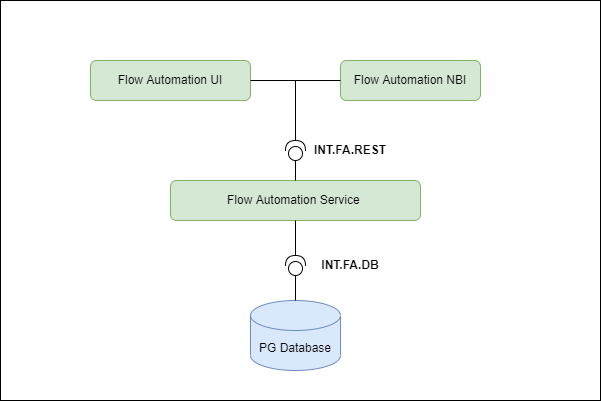
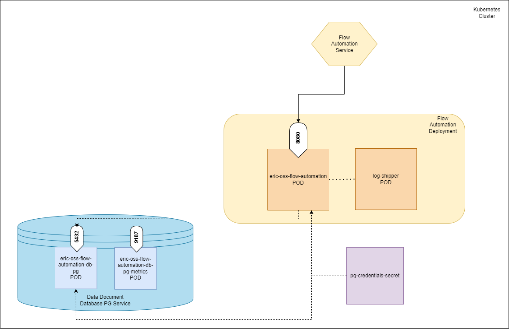

# Flow Automation User Guide

[TOC]

## Overview

### Description of the service

Flow Automation is a generic workflow-based automation framework and application. It allows designers to automate tasks through the use of Flows.

In addition, and in order to make automation design easy and efficient, Flow Automation provides a suite of components. For example:

* Flow User Tasks which allow flows to interact with users
* Flow Execution Report which can present output of flow execution to users
* Flow API and Flow Java Libraries which can be used to implement low level logic in combination with Flow Scripting

### Features
#### Automation based on process modeling
* A key component in Flow Automation is the BPMN process engine which enables the implementation of automated processes using a combination of visual modeling and scripting. Tasks and events are connected together and can additionally make use of conditional logic, scripts, and expressions to achieve automation goals. These goals can range from simple sequences to complex parallel branches. Tasks can perform actions on external systems and where required can interact with users.

#### Model-driven automation
* The primary modeled artifacts which a Flow consist of are process models (BPMN) and data models. Data models describe the inputs needed when creating a Flow Execution (executing a Flow) and the outputs produced by a Flow Execution. The data models are expressed in JSON Schema.

#### REST & UI Interface
* The Flow Automation REST interface provides an external API over which the capabilities of Flow Automation can be accessed and controlled. The primary resources exposed on this interface are Flows and Flow Executions. This API is access-controlled enabling users to be assigned roles which can allow and prevent access to specific resource endpoints.
* The Flow Automation GUI provides a user interface over which the capabilities of Flow Automation can be interactively accessed and controlled. Flows and Flow Instances can be administered via this user interface. The user interface is access-controlled enabling users to be assigned roles which can allow and prevent access to specific GUI features.

#### Flow management
* Flows can be imported, removed, enabled, disabled, activated, and deactivated. This fine control over the status of Flows may be needed when evolving versions of Flows.
* All Flows are versioned, allowing evolution and upgrade of Flows at runtime, without need for upgrade of Flow Automation. Executing Flows belonging to many versions of a Flow can be active concurrently.
* Flows can be imported-to and removed-from Flow Automation at runtime without any need for Flow Automation upgrade.

#### Flow execution & monitoring
* A Flow is executed by creating an execution (instance). Many Flow Executions for many different Flows can be active concurrently. Many Flow Executions for the same Flow can be active concurrently. While executing, the Flow Execution can provide an interactive experience via user tasks (eg. to ask user for permission to perform a sensitive operation) and also produce live reports. Live reports can also be accessed via REST.
* A Flow Execution can be monitored by a user by observing live reports, viewing events produced by the execution, and viewing a live visual progress based on the graphical BPMN model.

#### Data lifecycle management
* Data produced by a Flow Execution is retained and is accessible over all interfaces for 7 days after completion of the execution. After this period Flow Automation housekeeping removes the historical data, thus controlling storage resource usage on an ongoing basis.

#### Security 
* Flow Automation complies with all security rules for the product and platform it executes on.
Role-based access control is applied to all REST resources and endpoints, and also to GUI-based operations.

#### Upgrade
* Flow Automation can be upgraded using the standard procedures that apply for the product and platform it executes on.

#### SDK
* The Flow Automation SDK allows automation designers to implement and test Flows. An extensive set of documentation, tools, examples, and best practices is provided.

### Main concepts
#### Flow
A Flow represents the definition of a specific automation in the form of a sequence of steps or operations (eg. upgrade software for segment of network) and contains process models, scripts, and data models. It is defined by a collection of BPMN processes organized in a predefined folder structure and packaged as a zip file.

#### Flow Instance
* A Flow Instance is a running instance of the flow. There can be multiple flow instances of a flow executing at the same time. The relationship between Flow and Flow Instance is similar to that between a Class and an Object in Object Oriented programming.
* A flow instance can have different states during execution, e.g. Started, Executing, Executed, Stopped, Failed etc. While executing, a flow instance can be stopped. A flow instance is considered to be completed when it reaches Executed, Stopped or Failed state.

#### Flow Execution
* A Flow Execution represents an instantiation of a Flow, and is referred to as a Flow Instance on Flow Automation GUI.


#### Flow Data Modeling
Data Models are used in Flow Automation for multiple purposes. For example:

* Flow input specification
* User Task models
* Report model

All the data models are based on JSON Schema.

### Supported Use Cases
#### UI
##### Flow Catalog
| Use Case ID                     | Use Case Title      | Compliance      |
|---------------------------------|---------------------|-----------------|
| UC.FA.UI.CATALOG.VIEW.1         | View flow catalog   | Fully supported |
| UC.FA.UI.CATALOG.FLOW.IMPORT.1  | Import flow         | Fully supported |
| UC.FA.UI.CATALOG.FLOW.ENABLE.1  | Enable flow         | Fully supported |
| UC.FA.UI.CATALOG.FLOW.DISABLE.1 | Disable flow        | Fully supported |
| UC.FA.UI.CATALOG.FLOW.START.1   | Start flow instance | Fully supported |

##### Flow Instances
| Use Case ID                               | Use Case Title                           | Compliance      |
|-------------------------------------------|------------------------------------------|-----------------|
| UC.FA.UI.FLOWINSTANCES.VIEW.1             | View flow instances                      | Fully Supported |
| UC.FA.UI.FLOWINSTANCES.VIEW.FILTER.FLOW.1 | Filter flow instances by flow            | Fully Supported |
| UC.FA.UI.FLOWINSTANCES.VIEW.FILTER.USER.1 | Filter flow instances by logged in user  | Fully Supported |
| UC.FA.UI.FLOWINSTANCES.START.1            | Start flow instance                      | Fully Supported |
| UC.FA.UI.FLOWINSTANCES.DISCARD.1          | Discard flow instance in setup           | Fully Supported |
| UC.FA.UI.FLOWINSTANCES.DELETE.1           | Delete inactive flow instance            | Fully Supported |
| UC.FA.UI.FLOWINSTANCES.STOP.1             | Stop active flow instance                | Fully Supported |

##### Flow Instance Details
| Use Case ID                                          | Use Case Title                               | Compliance      |
|------------------------------------------------------|----------------------------------------------|-----------------|
| UC.FA.UI.INSTANCEDETAILS.VIEW.1                      | View flow instance details                   | Fully Supported |
| UC.FA.UI.INSTANCEDETAILS.EVENT.VIEW.1                | View events                                  | Fully Supported |
| UC.FA.UI.INSTANCEDETAILS.DIAGRAM.DEFINITION.1        | View process diagram definition              | Fully Supported |
| UC.FA.UI.INSTANCEDETAILS.DIAGRAM.ACTIVITY.1          | View process diagram activity                | Fully Supported |
| UC.FA.UI.INSTANCEDETAILS.SETUP.RESTART.1             | Restart flow execution in setup phase        | Fully Supported |
| UC.FA.UI.INSTANCEDETAILS.SETUP.DISCARD.1             | Discard flow execution in setup phase        | Fully Supported |
| UC.FA.UI.INSTANCEDETAILS.SETUP.USERTASK.VIEW.1       | View user tasks in setup phase               | Fully Supported |
| UC.FA.UI.INSTANCEDETAILS.SETUP.USERTASK.CHECK.1      | Check previous task inputs in setup phase    | Fully Supported |
| UC.FA.UI.INSTANCEDETAILS.SETUP.USERTASK.COMPLETE.1   | Complete user task in setup phase            | Fully Supported |
| UC.FA.UI.INSTANCEDETAILS.SETUP.USERTASK.BACK.1       | Go back user task in setup phase             | Fully Supported |
| UC.FA.UI.INSTANCEDETAILS.SETUP.USERTASK.REVIEW.1     | Review and Confirm Execute in setup phase    | Fully Supported |
| UC.FA.UI.INSTANCEDETAILS.SETUP.USERTASK.EXPORT.1     | Export setup configuration in setup phase    | Fully Supported |
| UC.FA.UI.INSTANCEDETAILS.SETUP.USERTASK.CONFIRM.1    | Confirm execution in setup phase             | Fully Supported |
| UC.FA.UI.INSTANCEDETAILS.EXECUTE.REPORT.1            | View flow instance report                    | Fully Supported |
| UC.FA.UI.INSTANCEDETAILS.EXECUTE.USERTASK.VIEW.1     | View user tasks in execute phase             | Fully Supported |
| UC.FA.UI.INSTANCEDETAILS.EXECUTE.USERTASK.COMPLETE.1 | Complete user task in execute phase          | Fully Supported |
| UC.FA.UI.INSTANCEDETAILS.EXECUTE.USERTASK.COMPLETE.2 | Complete grouped user task in execute phase  | Fully Supported |
| UC.FA.UI.INSTANCEDETAILS.EXECUTE.EXPORT.SETUP.1      | Export setup configuration                   | Fully Supported |
| UC.FA.UI.INSTANCEDETAILS.EXECUTE.EXPORT.REPORT.1     | Export report                                | Fully Supported |
    
#### REST
##### Flow
| Use Case ID                | Use Case               | Compliance      |
|----------------------------|------------------------|-----------------|
| UC.FA.REST.FLOW.FLOWS.1    | Get flows              | Fully Supported |
| UC.FA.REST.FLOW.FLOW.1     | Get flow               | Fully Supported |
| UC.FA.REST.FLOW.IMPORT.1   | Import Flow            | Fully Supported |
| UC.FA.REST.FLOW.DELETE.1   | Delete Flow            | Fully Supported |
| UC.FA.REST.FLOW.ENABLE.1   | Enable flow            | Fully Supported |
| UC.FA.REST.FLOW.ACTIVATE.1 | Activate flow version  | Fully Supported |
| UC.FA.REST.FLOW.SCHEMA.1   | Get flow input schema  | Fully Supported |
| UC.FA.REST.FLOW.EXECUTE.1  | Execute flow           | Fully Supported |

##### Flow Execution
| Use Case ID                                  | Use Case Title                                       | Compliance      |
|----------------------------------------------|------------------------------------------------------|-----------------|
| UC.FA.REST.FLOWEXECUTION.1                   | Get flow executions                                  | Fully Supported |
| UC.FA.REST.FLOWEXECUTION.SUSPEND.1           | Suspend active flow execution                        | Fully Supported |
| UC.FA.REST.FLOWEXECUTION.SUSPEND.2           | Suspend all active flow executions for flow version  | Fully Supported |
| UC.FA.REST.FLOWEXECUTION.STOP.1              | Stop active flow execution                           | Fully Supported |
| UC.FA.REST.FLOWEXECUTION.DELETE.1            | Delete inactive flow execution                       | Fully Supported |
| UC.FA.REST.FLOWEXECUTION.INPUT.1             | Get flow input schema and data                       | Fully Supported |
| UC.FA.REST.FLOWEXECUTION.USERTASK.1          | Get user tasks                                       | Fully Supported |
| UC.FA.REST.FLOWEXECUTION.USERTASK.SCHEMA.1   | Get user task schema                                 | Fully Supported |
| UC.FA.REST.FLOWEXECUTION.USERTASK.BACK.1     | Move to previous user task                           | Fully Supported |
| UC.FA.REST.FLOWEXECUTION.USERTASK.COMPLETE.1 | Complete user task                                   | Fully Supported |
| UC.FA.REST.FLOWEXECUTION.REPORT.1            | Get flow execution report                            | Fully Supported |
| UC.FA.REST.FLOWEXECUTION.REPORT.SCHEMA.1     | Get flow execution report schema                     | Fully Supported |
| UC.FA.REST.FLOWEXECUTION.REPORT.VARIABLE.1   | Get flow execution report variable                   | Fully Supported |
| UC.FA.REST.FLOWEXECUTION.RESOURCE.1          | Get flow execution resource                          | Fully Supported |
| UC.FA.REST.FLOWEXECUTION.EVENT.1             | Get flow execution events                            | Fully Supported |

### API
Please refer to the [API documentation](https://adp.ericsson.se/marketplace/flow-automation/documentation/1.0.0/dpi/api-documentation).

### Architecture



*Figure 1: Flow Automation Architecture Diagram*

| Interface Logical Name | Description                                                                                                                                                 |
|------------------------|-------------------------------------------------------------------------------------------------------------------------------------------------------------|
| INT.FA.REST            | This is the mediator between the users and the FA Service. The REST endpoints are supported for the deployment, execution, and the administration of flows. |
| INT.FA.DB              | This is the database interface of the FA Service application which is used by the FA Service and Camunda BPM to store data about the flows.                 |

### Deployment View
Flow automation is packaged as a Docker container.

It supports deployment on Kubernetes.

It is dependent on PostgreSQL that is installed as a database backend.


*Figure 2: Flow Automation Deployment View Diagram in a Kubernetes cluster*

To deploy the Service, refer to the [Deployment](#deployment) section, which:
* explains how to get started using Flow Automation in the supported environments.

---

## Deployment

### Prerequisites
* A running Kubernetes environment
* Some knowledge of the Kubernetes environment, including the networking details
* Access rights to deploy and manage workloads
* Availability of the kubectl CLI tool with correct authentication details. Contact the Kubernetes System Admin if needed
* Availability of the helm 3 package
* Availability of Helm charts and Docker images for the service and all dependent services
* Document Database PG Service should be installed before installing the Flow Automation Service.
* The PM Server is optional. Install it if metric data from Flow Automation should be collected by the PM Server.
* The Log Transformer is optional. Install it if log data from Flow Automation Service should be directly sent to the Log Transformer.

### Deployment in a Kubernetes Environment Using Helm
This section describes how to deploy the service in Kubernetes using Helm version 3 and the kubectl CLI client. [Helm](https://helm.sh/) is a package manager for Kubernetes that streamlines the installation and management of Kubernetes applications

#### Preparation
Prepare Helm chart and Docker images.
Helm chart in the following link can be used for installation: https://arm.seli.gic.ericsson.se/artifactory/proj-eric-oss-drop-helm/eric-oss-flow-automation/

#### Pre-Deployment Checks for Flow Automation
Ensure the following:
* The <RELEASE_NAME> is not used already in the corresponding cluster. Use helm list command to list the existing deployments (and delete previous deployment with the corresponding <RELEASE_NAME> if needed).
* The same namespace is used for all deployments.

#### Helm Chart Installation of Document Database PG Service
For more detailed information related to the Document Database PG Service installation see [Document Database PG documentation](https://adp.ericsson.se/marketplace/document-database-pg/documentation/7.4.0/dpi/service-user-guide). (Deployment information can be found under Installation >> Deployment Guide)

The current installation is only applicable when not using mutual TLS (mTLS) between Flow Automation and the Document Database PG service (global.security.tls.enabled is set to false).

##### Addtional Secret Resrouce for Document Database PG
Create a kubernetes secret resource for Database PG to store the credentials of user name and password for different types of users of Document Database PG service. This secret will be used as configurations parameters in values.yaml file during the installation of Document Database PG Service and Flow Automation Service.

The values of the following Document Database PG Service configuration parameters must match the values set at deployment time of Flow Automation Service.

| Parameter                         | Description                                                                                                    |
|-----------------------------------|----------------------------------------------------------------------------------------------------------------|
| credentials.kubernetesSecretName	 | The the name of secret resource you created.                                                                   |
| credentials.keyForUserId          | Key of customized user name in the secret for user connecting to PostgreSQL database.                          |
| credentials.keyForUserPw          | Key of customized user password for user connecting to PostgreSQL database.                                    |
| credentials.keyForSuperPw	        | Key of customized super user password for PostgreSQL database, the user name for the super user is "postgres". |


**NOTE**: Create the secret in the same namespace as the deployments of Document Database PG Service and Flow Automation Service. The secret is reused for Flow Automation deployment. See [Configuration Parameters](#configuration-parameters) for configuration details.

##### Helm Chart Installation of Performance Management (PM) Server
Optional. Deploy only if metrics of Flow Automation Service need to be collected.

For more detailed information related to PM Server installation see [PM Server Deployment Guide](https://adp.ericsson.se/marketplace/pm-server/documentation/development/dpi/service-deployment-guide).

##### Helm Chart Installation of Log Transformer
Optional. Deploy if the Flow Automation log data should be directly sent to the Log Transformer.

For more detailed information related to the Log Transformer installation see [Log Transformer Documentation](https://adp.ericsson.se/marketplace/log-transformer/documentation/development/dpi/service-user-guide).

##### Helm Chart Installation of Flow Automation Service
**NOTE**: Ensure all dependent services are deployed and healthy before you continue with this step (see previous chapter).

Users can override the default values provided in the values.yaml template of the Helm chart. The recommended parameters to override are listed in the following section: Configuration Parameters.

###### Deploy the Flow Automation Service
1. Deploy the Flow Automation Service without TLS (default):

```shell
helm install <RELEASE_NAME> <CHART_REFERENCE> --namespace <NAMESPACE>
```

###### Verify the Availability of the Flow Automation Service
In order to check a successful deployment of the Flow Automation Service, the following steps can be performed

1. Check if the chart is installed with the provided release name and in the related namespace using helm ls command
    ```shell
    helm ls
    ```
    Output: 
    ```shell
    NAME   	                            NAMESPACE	 REVISION	UPDATED                                	STATUS  	CHART                               	APP VERSION
    eric-oss-flow-automation-release	saga     	 1       	2022-04-28 11:57:27.987365491 +0100 IST	deployed	eric-oss-flow-automation-1.0.71         1.0
    ```
    Chart status should be reported as `deployed`.

2. Verify the status of the Helm chart deployed, by getting the status for your chart installed:
    ```shell
    helm status eric-oss-flow-automation-release -n <NAMESPACE>
    ```
    
    Example output:
    ```shell
    LAST DEPLOYED: Mon Apr 4 13:53:07 2022 NAMESPACE: test-deployment-namespace STATUS: DEPLOYED
    ```
    Chart status should be reported as `DEPLOYED`.
    
    ```shell
    kubectl get deployment -n <NAMESPACE>
    ```
    Example output:
    ```shell
    NAME                       READY   UP-TO-DATE   AVAILABLE   AGE
    eric-oss-flow-automation   1/1     1            1           26h
    ```
    All pods should be reported as `Ready`.

3. (_Optional_) Verify that the Flow Automation Service REST API responds successfully with a HTTPS 200 OK, by doing a HTTPS GET request on the Flow Automation pod using curl:
    ```shell
    kubectl -n <NAMESPACE> exec -it <FA_POD_NAME> -c eric-oss-flow-automation -- curl http://localhost:8080/flow-automation/v1/flows
    ```
    &lt;NAMESPACE&gt;: String value, a name to be used dedicated by the user for deploying own Helm charts.
    
    <FA_POD_NAME>: String value, the name of one pod deployed in the Flow Automation Service.

    Should return the list of flows deployed on the server with HTTP status code 200 OK.

For troubleshooting information see [Troubleshooting](#troubleshooting) section.

### Configuration Parameters
The Flow Automation Service uses a configuration interface based on environment variables that are defined in the Helm chart. You can set these variables during the deployment of the Helm chart (using the --set argument).

#### Mandatory Configuration Parameters
These parameters are mandatory to set at deployment time. If not provided, the deployment will fail. There are no default values provided for this type of parameters.

| Parameter                                | Description                                                                                                                                                                                                 |
|------------------------------------------|-------------------------------------------------------------------------------------------------------------------------------------------------------------------------------------------------------------|
| datasource.postgresHost                  | Name of Postgres Host used for connecting to Document Database PG Service.                                                                                                                                  |
| datasource.credentials.secret            | Name of Kubernetes secret which stores user name and password, used for connecting to Document Database PG Service. It is described in the section: Helm Chart Installation of Document Database PG Service |
| datasource.credentials.keyForSuperUserId | The key of the user name of super user for Document Database PG in the secret resource.                                                                                                                     |
| datasource.credentials.keyForSuperPw	    | The key of the password of super user for Document Database PG in the secret resource.                                                                                                                      |

#### Optional Configuration Parameters

| Parameter                                                          | Description                                                                                                                                                                                                                                                                                                                                                                                                                                                           | Default Value     |
|--------------------------------------------------------------------|-----------------------------------------------------------------------------------------------------------------------------------------------------------------------------------------------------------------------------------------------------------------------------------------------------------------------------------------------------------------------------------------------------------------------------------------------------------------------|-------------------|
| replicaCount                                                       | The number of Flow Automation instances. Ignored, if autoscaling is enabled.                                                                                                                                                                                                                                                                                                                                                                                          | 1                 |
| podDisruptionBudget.minAvailable	                                  | Minimum number/percentage of Pods that must remain available during the planned disruption.                                                                                                                                                                                                                                                                                                                                                                           | 	40%              | 
| updateStrategy.type                                                | 	Flow Automation's update Strategy                                                                                                                                                                                                                                                                                                                                                                                                                                    | 	RollingUpdate    |
| updateStrategy.rollingUpdate.maxSurge                              | 	The maximum number of Pods that can be created over the desired number of Pods	                                                                                                                                                                                                                                                                                                                                                                                      | 1                 |
| updateStrategy.rollingUpdate.maxUnavailable                        | 	The maximum number of Pods that can be unavailable during the update process                                                                                                                                                                                                                                                                                                                                                                                         | 	0                |
| labels                                                             | 	A map for setting custom labels for all Kubernetes resources                                                                                                                                                                                                                                                                                                                                                                                                         | 	{}               |
| imageCredentials.eric-oss-flow-automation.pullPolicy               | 	The Authorization Proxy image pull policy. Overrides global.registry.imagePullPolicy	                                                                                                                                                                                                                                                                                                                                                                                | IfNotPresent      |
| imageCredentials.eric-oss-flow-automation.repoPath                 | 	Repository path for the Docker image.                                                                                                                                                                                                                                                                                                                                                                                                                                |
| imageCredentials.eric-oss-flow-automation.registry                 | 	Docker registry	                                                                                                                                                                                                                                                                                                                                                                                                                                                     | {}                |
| imagePullSecrets	                                                  | Secret used for pull image from the docker registry, applicable only if imageCredentials.registry.url is set. It overrides global.pullSecret parameter.	                                                                                                                                                                                                                                                                                                              | ""                |
| serviceAccount.create                                              | 	Specifies whether a service account should be created	                                                                                                                                                                                                                                                                                                                                                                                                               | true              |
| serviceAccount.name	                                               | The name of the service account to use. If not set and create is true, a name is generated using the fullname template.	                                                                                                                                                                                                                                                                                                                                              | ""                |
| service.type                                                       | The type of eric-oss-flow-automation to be created.                                                                                                                                                                                                                                                                                                                                                                                                                   | ClusterIP         |
| service.port                                                       | The port of eric-oss-flow-automation will be applied.                                                                                                                                                                                                                                                                                                                                                                                                                 | 8080              |
| service.endpoints.chassisapi.tls.enforced                          | 	Defines whether TLS support should be enforced or HTTP support should be also allowed. Specify either "optional" to allow http also or "required" for TLS only. Only valid if global.security.tls.enabled is set to true.	                                                                                                                                                                                                                                           | required          |
| service.endpoints.chassisapi.tls.verifyClientCertificate           | 	Defines whether client certificate validation should be enforced or not. Specify either "optional" or "required". Only valid if global.security.tls.enabled is set to true.	                                                                                                                                                                                                                                                                                         | required          |
| ingress.enabled                                                    | 	Enabled ingress feature of exposing Flow Automation REST API outside cluster.                                                                                                                                                                                                                                                                                                                                                                                        | 	false            |
| ingress.ingressClass	                                              | Ingress class name indicating which ingress controller instance is consuming the ingress resource                                                                                                                                                                                                                                                                                                                                                                     | 	OAM-IngressClass |                                                                                                                                       
| eric-pm-server.rbac.appMonitoring.enabled                          | Enables RBAC for single Application Monitoring                                                                                                                                                                                                                                                                                                                                                                                                                        | true              | 
| resources.eric-oss-flow-automation.requests.memory                 | 	The requested amount of memory per instance of Flow Automation	                                                                                                                                                                                                                                                                                                                                                                                                      | 3072Mi            |
| resources.eric-oss-flow-automation.requests.cpu                    | 	The requested amount of CPU per instance of Flow Automation	                                                                                                                                                                                                                                                                                                                                                                                                         | 500m              |
| resources.eric-oss-flow-automation.requests.ephemeral-storage      | 	The requested amount of ephemeral storage per instance of Flow Automation	                                                                                                                                                                                                                                                                                                                                                                                           | ""                |
| resources.eric-oss-flow-automation.limits.memory                   | 	The maximum amount of memory allowed per instance of Flow Automation	                                                                                                                                                                                                                                                                                                                                                                                                | 3596Mi            | 
| resources.eric-oss-flow-automation.limits.cpu	                     | The maximum amount of CPU allowed per instance of Flow Automation	                                                                                                                                                                                                                                                                                                                                                                                                    | 1700m             |
| resources.eric-oss-flow-automation.limits.ephemeral-storage        | 	The maximum amount of ephemeral storage per instance of Flow Automation	                                                                                                                                                                                                                                                                                                                                                                                             | ""                |
| resources.create-db.requests.memory                                | 	The requested amount of memory per instance of the Create DB init container.	                                                                                                                                                                                                                                                                                                                                                                                        | 100Mi             |
| resources.create-db.requests.cpu                                   | 	The requested amount of CPU per instance of the Create DB init container.	                                                                                                                                                                                                                                                                                                                                                                                           | 100m              |
| resources.create-db.requests.ephemeral-storage                     | 	The requested amount of ephemeral storage per instance of the Create DB init container.	                                                                                                                                                                                                                                                                                                                                                                             | ""                |
| resources.create-db.limits.memory                                  | 	The maximum amount of memory allowed per instance of the Create DB init container.	                                                                                                                                                                                                                                                                                                                                                                                  | 50Mi              |
| resources.create-db.limits.cpu                                     | 	The maximum amount of CPU allowed of the Create DB init container.	                                                                                                                                                                                                                                                                                                                                                                                                  | 50m               |
| resources.create-db.limits.ephemeral-storage                       | 	The maximum amount of ephemeral storage per instance of the Create DB init container                                                                                                                                                                                                                                                                                                                                                                                 | 	""               |
| resources.create-schema.requests.memory                            | 	The requested amount of memory per instance of the Create Schema init container	                                                                                                                                                                                                                                                                                                                                                                                     | 100Mi             |
| resources.create-schema.requests.cpu                               | 	The requested amount of CPU per instance of the Create Schema init container.                                                                                                                                                                                                                                                                                                                                                                                        | 	100m             |
| resources.create-schema.requests.ephemeral-storage	                | The requested amount of ephemeral storage per instance of the Create Schema init container                                                                                                                                                                                                                                                                                                                                                                            | 	""               |
| resources.create-schema.limits.memory                              | 	The maximum amount of memory allowed per instance of the Create Schema init container.	                                                                                                                                                                                                                                                                                                                                                                              | 50Mi              |
| resources.create-schema.limits.cpu                                 | 	The maximum amount of CPU allowed of the Create Schema init container.	                                                                                                                                                                                                                                                                                                                                                                                              | 50m               |
| resources.create-schema.limits.ephemeral-storage                   | 	The maximum amount of ephemeral storage per instance for the Create Schema init container                                                                                                                                                                                                                                                                                                                                                                            | 	""               |
| autoscaling.enabled	                                               | Parameter to enable autoscaling. If set to true, the replicaCount parameter is ignored.	                                                                                                                                                                                                                                                                                                                                                                              | false             |
| autoscaling.minReplicas                                            | 	The number of minimum replicas when using autoscaling.	1                                                                                                                                                                                                                                                                                                                                                                                                             |
| autoscaling.maxReplicas	                                           | The number of maximum replicas when using autoscaling.	100                                                                                                                                                                                                                                                                                                                                                                                                            |
| autoscaling.targetCPUUtilizationPercentage                         | The threshold of CPU utilization presentation. It will scale out the pod and create a new repliace when the threshold is reached.                                                                                                                                                                                                                                                                                                                                     | 80                | 
| tolerations	                                                       | Set node tolerations for the pod(s). Not set by default	                                                                                                                                                                                                                                                                                                                                                                                                              | ""                |
| affinity.podAntiAffinity	                                          | Set inter-pod anti-affinity policy to Kubernetes scheduler for all pods in the service. "hard" specifies rules that must be met for a pod to be scheduled onto a node (just like nodeSelector but using a more expressive syntax). This might result in a minimum required nodes available, if hard is used as all pods will have to be scheduled to another node. While "soft" specifies preferences that the scheduler will try to enforce but will not guarantee.	 | soft              |
| topologySpreadConstraints                                          | 	The topologySpreadConstraints specifies how to spread Flow Automation pods among the given topology. Valid fields are maxSkew { range=1..max }, topologyKey and whenUnsatisfiable { choice="DoNotSchedule, ScheduleAnyway" }.                                                                                                                                                                                                                                        | 	""               |
| terminationGracePeriodSeconds	                                     | The duration of the grace period in seconds. If the processes of Flow Automation are still running after the defined grace period, the processes are force killed. The duration should not be set below 10, since it can interfere with the normal graceful shutdown. When changing the grace period also consider the worker timeout. 	                                                                                                                              | 30                | 
| podPriority.eric-oss-flow-automation.priorityClassName             | 	The configuration of the priority class for Flow Automation pod assigning importance relative to other pods.                                                                                                                                                                                                                                                                                                                                                         | 	""               |
| probes.eric-oss-flow-automation.livenessProbe.failureThreshold     | 	Minimum consecutive failures for the probe to be considered failed.	                                                                                                                                                                                                                                                                                                                                                                                                 | 3                 |
| probes.eric-oss-flow-automation.livenessProbe.initialDelaySeconds  | 	Number of seconds after the container has started before liveness probes are initiated.	                                                                                                                                                                                                                                                                                                                                                                             | 60                |
| probes.eric-oss-flow-automation.livenessProbe.periodSeconds        | 	How often in seconds to perform the liveness probe.	                                                                                                                                                                                                                                                                                                                                                                                                                 | 30                |
| probes.eric-oss-flow-automation.livenessProbe.timeoutSeconds       | 	Number of seconds after which the probe times out.	                                                                                                                                                                                                                                                                                                                                                                                                                  | 60                |
| probes.eric-oss-flow-automation.readinessProbe.failureThreshold    | 	Minimum consecutive failures for the probe to be considered failed.                                                                                                                                                                                                                                                                                                                                                                                                  | 	3                |
| probes.eric-oss-flow-automation.readinessProbe.initialDelaySeconds | 	Number of seconds after the container has started before liveness probes are initiated.                                                                                                                                                                                                                                                                                                                                                                              | 	180              |
| probes.eric-oss-flow-automation.readinessProbe.periodSeconds       | 	How often in seconds to perform the readiness probe.                                                                                                                                                                                                                                                                                                                                                                                                                 | 	30               |
| probes.eric-oss-flow-automation.readinessProbe.timeoutSeconds      | 	Number of seconds after which the probe times out.	                                                                                                                                                                                                                                                                                                                                                                                                                  | 60                |
| datasource.postgresPort                                            | 	The port used for connection to Document Database PG.	                                                                                                                                                                                                                                                                                                                                                                                                               | 5432              | 
| datasource.databaseName	                                           | The name of the database created by the Flow Automation Service.	                                                                                                                                                                                                                                                                                                                                                                                                     | flowautomationdb  | 
| datasource.creationTime                                            | The startup wait time for the init container createdb.                                                                                                                                                                                                                                                                                                                                                                                                                | 10                | 

Log Transformer Helm Chart Parameters for Log Transformer with Shipper as side car. These parameters are not mandatory. If not explicitly set, the default values provided in the helm chart are used.

| Parameter                                            | Description                                                                                                                                                                                                                                                                                                                                                                                                                                                                                                                                                                                                                                     | Default Value                                         |
|------------------------------------------------------|-------------------------------------------------------------------------------------------------------------------------------------------------------------------------------------------------------------------------------------------------------------------------------------------------------------------------------------------------------------------------------------------------------------------------------------------------------------------------------------------------------------------------------------------------------------------------------------------------------------------------------------------------|-------------------------------------------------------|
| imageCredentials.logshipper.pullPolicy	              | The Authorization Proxy image pull policy. Overrides global.registry.imagePullPolicy	                                                                                                                                                                                                                                                                                                                                                                                                                                                                                                                                                           | IfNotPresent                                          |
| imageCredentials.logshipper.repoPath	                | Repository path for the Docker image.                                                                                                                                                                                                                                                                                                                                                                                                                                                                                                                                                                                                           ||     |     |     |
| imageCredentials.logshipper.registry                 | 	Docker Registry	                                                                                                                                                                                                                                                                                                                                                                                                                                                                                                                                                                                                                               | {}                                                    |
| resources.logshipper.requests.memory	                | The requested amount of memory per instance of Logshipper	                                                                                                                                                                                                                                                                                                                                                                                                                                                                                                                                                                                      | 50Mi                                                  |
| resources.logshipper.requests.cpu	                   | The requested amount of CPU per instance of Logshipper	                                                                                                                                                                                                                                                                                                                                                                                                                                                                                                                                                                                         | 50m                                                   |
| resources.logshipper.requests.ephemeral-storage      | 	The requested amount of ephemeral storage per instance of Logshipper	                                                                                                                                                                                                                                                                                                                                                                                                                                                                                                                                                                          | ""                                                    |
| resources.logshipper.limits.memory                   | 	The maximum amount of memory allowed per instance of Logshipper	                                                                                                                                                                                                                                                                                                                                                                                                                                                                                                                                                                               | 100Mi                                                 |
| resources.logshipper.limits.cpu	                     | The maximum amount of CPU allowed per instance of Logshipper	                                                                                                                                                                                                                                                                                                                                                                                                                                                                                                                                                                                   | 100m                                                  |
| resources.logshipper.limits.ephemeral-storage        | 	The maximum amount of CPU per instance of Logshipper	                                                                                                                                                                                                                                                                                                                                                                                                                                                                                                                                                                                          | ""                                                    |
| probes.logshipper.livenessProbe.failureThreshold	    | Number of failures before considering the probe to have failed                                                                                                                                                                                                                                                                                                                                                                                                                                                                                                                                                                                  | 	3                                                    |
| probes.logshipper.livenessProbe.initialDelaySeconds	 | Delay, in seconds, before Kubernetes starts polling the service for liveness. This value may have to be increased if pod restarts are occurring.	                                                                                                                                                                                                                                                                                                                                                                                                                                                                                               | 300                                                   |
| probes.logshipper.livenessProbe.periodSeconds        | 	How often in seconds to perform the liveness probe.	                                                                                                                                                                                                                                                                                                                                                                                                                                                                                                                                                                                           | 30                                                    |
| probes.logshipper.livenessProbe.timeoutSeconds       | 	Number of seconds to allow before the probe times out	                                                                                                                                                                                                                                                                                                                                                                                                                                                                                                                                                                                         | 15                                                    |
| probes.logshipper.livenessProbe.successThreshold     | 	Minimum consecutive successes for the probe to be considered successful.                                                                                                                                                                                                                                                                                                                                                                                                                                                                                                                                                                       | 	1                                                    |
| probes.logshipper.readinessProbe.failureThreshold	   | Number of failures before considering the probe to have failed	                                                                                                                                                                                                                                                                                                                                                                                                                                                                                                                                                                                 | 3                                                     |
| probes.logshipper.readinessProbe.periodSeconds	      | How often in seconds to perform the readiness probe.	                                                                                                                                                                                                                                                                                                                                                                                                                                                                                                                                                                                           | 30                                                    |
| probes.logshipper.readinessProbe.successThreshold    | 	Minimum consecutive successes for the probe to be considered successful.	                                                                                                                                                                                                                                                                                                                                                                                                                                                                                                                                                                      | 1                                                     |
| probes.logshipper.readinessProbe.timeoutSeconds      | 	Number of seconds to allow before the probe times out	                                                                                                                                                                                                                                                                                                                                                                                                                                                                                                                                                                                         | 15                                                    |
| probes.logshipper.readinessProbe.initialDelaySeconds | 	Delay, in seconds, before Kubernetes starts polling the service for readiness. This value may have to be increased if pod restarts are occurring.	                                                                                                                                                                                                                                                                                                                                                                                                                                                                                             | 30                                                    |
| logshipper.storagePath	                              | Share volume name where logs writes	logs                                                                                                                                                                                                                                                                                                                                                                                                                                                                                                                                                                                                        | logs                                                  |
| logshipper.storageAllocation                         | 	Storage limit for shared volume. This value needs to be set based on the size of log producer's log file plus the size of Log Shipper's worker files. The Log Shipper worker file calculation is based on following factors (size of Log Shipper sidecar internal logs + Filebeat Registry). The log producer's log file calculation is based on number of containers configured in a pod and its log file size x number of log rotations configured. StorageAllocation = size of log producer's log file (size x number of log rotation) + 40MB (Log Shipper's worker files).	                                                                | 500Mi                                                 |
| logshipper.privileged                                | Alpha feature When set to true, Log Shipper container is deployed with privileged access to mount volumes on the host. **WARNING!** This should only be set if the Kubernetes distribution requires a privileged container to mount worker node hostPath and to read logs.                                                                                                                                                                                                                                                                                                                                                                      | true                                                  |
| logshipper.harvester.closeTimeout                    | 	Set a predefined duration Log Shipper will have file handlers open. Log Shipper will continue where it left off in the file after the file handle was closed.This setting is here to ensure file handlers are not kept open forever in the case Log Shippers output is blocked or if there is a high surge in log events causing log file to rotate even before Log Shipper can reach end of file. You can change value of the logshipper.harvester.closeTimeout or disable this by setting the value to 0. WARNING! Potential data loss if Log Shipper does not manage to process a file before it is deleted and the file handle is closed.	 | 5m                                                    |
| logshipper.harvester.logData.subPaths	               | Add multiple log sub path as an YAML sequence/array.	                                                                                                                                                                                                                                                                                                                                                                                                                                                                                                                                                                                           | One subpath is set by default jboss/server.log.       |
| logshipper.harvester.logData.excludeLines	           | A list of regular expressions to match the log events that are to be excluded during harvesting. Refer to [Filebeat-Input-Log-Exclude-Lines](https://www.elastic.co/guide/en/beats/filebeat/current/filebeat-input-log.html#filebeat-input-log-exclude-lines) examples. **NOTE**: Inclusion or exclusion filters defined at the parent level are not applied to sub paths. **WARNING!** The content in logshipper.includeLines is called before excludeLines, potential data loss if the filtering sequence is not applied correctly.                                                                                                           | One line is included by default "org.jboss.as.config" |
| logshipper.harvester.logData.logplane	               | Override logshipper.logplane for these paths only. This should generally never have a default set by Generic Services but still be documented to be overridden by application if logs are deemed necessary to separate, such as audit logs.	                                                                                                                                                                                                                                                                                                                                                                                                    | fa                                                    |
| logshipper.logtransformer.host	                      | Kubernetes service name for accessing the Logstash host. This is used as an IP address and must be the same as the name given to the Logstash service in that Helm chart.	                                                                                                                                                                                                                                                                                                                                                                                                                                                                      | eric-log-transformer                                  |
| log.outputs	                                         | Supported values ["stdout", "stream"]	                                                                                                                                                                                                                                                                                                                                                                                                                                                                                                                                                                                                          | "stream"                                              |
| log.logshipper.level                                 | 	Set the logging level for Log Shipper. The accepted values are: "debug", "info", "warning" and "error".	"info"                                                                                                                                                                                                                                                                                                                                                                                                                                                                                                                                 |                                                       |

### Service Dimensioning
The service provides by default resource request values and resource limit values as part of the Helm chart. These values correspond to a default size for deployment of an instance. This chapter gives guidance in how to do service dimensioning and how to change the default values when needed.

#### Override Default Dimensioning Configuration
If other values than the default resource request and default resource limit values are preferred, they must be overridden at deployment time.

Here is an example of the command of helm install where resource requests and resource limits are set:

```shell
helm install <RELEASE_NAME> <CHART_REFERENCE> --namespace <NAMESPACE> \
--set resources.eric-oss-flow-automation.requests.cpu=300m \
--set resources.eric-oss-flow-automation.requests.memory=1024Mi \
--set resources.eric-oss-flow-automation.limits.cpu=100m \
--set resources.eric-oss-flow-automation.limits.memory=2048Mi
```
#### Use Maximum (Default) Configuration per Service Instance
The maximum recommended configuration per instance is provided as default in the Helm chart. Both Resource Request values and Resource Limit values are included in the helm charts.

### Hardening
The service is by default pre-hardened. No additional hardening is required. The following pre-hardening actions have been made:

1. The service is built on a container image with small footprint. Only the required libraries are included. 
2. The service utilizes a container optimized operating system (Common Base OS) and latest security patches are applied.
3. The container goes through vulnerability scanning.
4. The service is configured to the strict minimum of services and ports to minimize the attack surface.

See [Hardening Guidelines](https://confluence.lmera.ericsson.se/display/AGW/Hardening+Guidelines) for more details.

### Upgrade Procedure
#### Execute the upgrade
Flow Automation Service supports upgrade without loss of persistent service configuration data. In Kubernetes the Helm chart upgrade can be performed to migrate the Flow Automation Service from the existing to a higher version.
1. Check if Flow Automation Service is installed in the system with a specific chart version.
   ```shell
   helm ls
   ```
   This should show that Flow Automation Service is installed having a release name and a specific chart revision and the chart status should be reported as DEPLOYED.

2. Check service type for the current Flow Automation Service deployment
   
   ```shell
   kubectl -n <NAMESPACE> describe service <SERVICE_NAME>
   ```
   Should print out the service details. Check the Type entry.
   
   &lt;NAMESPACE&gt;: String value, the namespace where Flow Automation Service is installed.
   
   &lt;SERVICE_NAME&gt;: The service name used during installation, typically eric-oss-flow-automation.

3. Migrate to a higher version using Helm upgrade procedure
   
   ```shell
   helm upgrade <RELEASE_NAME> <CHART_REFERENCE>
   ```
   Should give the output Release <RELEASE_NAME> has been upgraded.
   
   <RELEASE_NAME>: String value, a name to identify and manage your Helm chart. 

   <CHART_REFERENCE>: A path to a packaged chart, a path to an unpacked chart directory or a URL to upgrade to.
   
   Example:
   
   ```shell
   helm upgrade eric-oss-flow-automation https://arm.seli.gic.ericsson.se/artifactory/proj-eric-oss-drop-helm/eric-oss-flow-automation/eric-oss-flow-automation-1.0.78-1.tgz
   ```
   
#### Verify the Flow Automation Service availability post upgrade

In order to check a successful upgrade of the Flow Automation Service, the following steps can be performed

1. Check if the upgrade of the chart with the provided release name and in the related namespace using 'helm ls' command
    ```shell
    helm ls -n <NAMESPACE>
    ```
    Chart status should be reported as DEPLOYED.

2. Verify the status of the helm chart by getting the status for your chart for which upgrade is done:
   ```shell
   helm status <RELEASE_NAME> -n <NAMESPACE>
   ```
   Chart status should be reported as DEPLOYED and Pod status should be reported as Running.

3. Verify with HTTP GET request that the Flow Automation Service REST API responds successfully with HTTP 200 OK by connecting to the pod of the Flow Automation Service and running the curl command below.
   ```shell
   kubectl -n <NAMESPACE> exec -it <FA_POD_NAME> -c eric-oss-flow-automation -- curl http://localhost:8080/flow-automation/v1/flows
   ```
   
   &lt;NAMESPACE&gt;: String value, a name to be used dedicated by the user for deploying own helm charts.
   
   <FA_POD_NAME>: Pod name can be obtained from the output of the following command: `kubectl get pods -n <NAMESPACE> | grep eric-oss-flow-automation`
    
   Should return response with HTTP status 200 OK.

--- 

## Security Guidelines
### Operative Tasks
This service does not include any operative tasks.

### External Ports
There are no external ports supported.

### Internal Ports
The ports and protocols that are used by the service are listed in the table.

| **Protocol** | **IP Address Type** | **Port**  | **Transport Protocol** | **IP Version** |
|:------------:|:-------------------:|:---------:|:----------------------:|:--------------:|
|     HTTP     |       OAM IP        | 8080:8080 |          TCP           |      IPv4      |
|     HTTP     |     Metrics IP      | 9990:9990 |          TCP           |      IPv4      |

### Certificates
No certificates are used in this service.

### Security Events That Can Be Logged
No security events are logged by the service.

---

## Privacy User Guidelines

The category listed in the table is stored by FA. The Privacy Technical
Index(PTI) value of FA is 30. Only the User ID is collected to record which user has imported and/or executed a flow.


| System User and Administrator Data Category| System User and Administrator Data Item |
|---|---|
| Basic Data | User ID |

---

## Troubleshooting
This section describes the troubleshooting functions and procedures for the Flow automation service. It provides the following information:
* Simple verification and possible recovery.
* The required information when reporting a bug or writing a support case, including all files and system logs that are needed.
* How to retrieve the above information from the system.

### Prerequisites
`kubectl` and `helm` CLI tool properly configured

### Installation
#### Verify Helm Chart deployed successfully
```shell
helm list -a
```
Sample Output:
```
NAME    NAMESPACE   REVISION    UPDATED                                 STATUS      CHART                                   APP VERSION
test-ta saga        1           2022-04-21 16:18:59.555625992 +0100 IST deployed    eric-oss-task-automation-ae-0.0.0-58
```

#### Verify that the pods are up and running
```shell
kubectl --namespace <namespace> get pods --selector=app=eric-oss-flow-automation
```
Sample command:
```shell
kubectl --namespace saga get pods --selector=app=eric-oss-flow-automation
```
Sample Output:
```shell
NAME                                        READY   STATUS    RESTARTS   AGE
eric-oss-flow-automation-76f7f4f7f5-drhxj   2/2     Running   0          24h
```

##### DB pods
```shell
kubectl --namespace saga get pods --selector=app=eric-oss-flow-automation-db-pg
```
Sample Output:
```shell
NAME                               READY   STATUS    RESTARTS   AGE
eric-oss-flow-automation-db-pg-0   2/2     Running   0          24h
```
If the status of the pods is not Running, then get the logs from the pods using the commands below:

```shell
kubectl --namespace <namespace> logs <pod name> -c <container name> > <filename>
```
The command will generate a file with given filename and add the logs of the given container of the pod.

```shell
kubectl --namespace <namespace>  logs eric-oss-flow-automation-76f7f4f7f5-drhxj -c eric-oss-flow-automation > app.log
```

##### Collect/View JBoss logs
If the pod is 'Running' but Flow automation service is not working as expected, please collect the JBoss logs using commands below:

```shell
kubectl cp <namespace>/<pod-name>:/jboss/standalone/log/server.log server.log -c eric-oss-flow-automation
```

Sample command:
```shell
kubectl cp saga/eric-oss-flow-automation-76f7f4f7f5-mzjhc:/jboss/standalone/log/server.log server.log -c eric-oss-flow-automation
```

### Deletion of Release
#### Uninstall helm release
```shell
helm uninstall <release name>
```

Sample command:
```shell
helm uninstall test-ta
```

In case of failures in deleting the release, the namespace can be deleted to remove all the associated resources.

```shell
kubectl delete namespace <namespace>
```
In case there is a failure in deleting the resources, they will have to be deleted one by one.

List all resources in the namespace using command below:
```shell
kubectl --namespace <namespace> get all
```
Delete the resource using command below:
```shell
kubectl --namespace <namespace> delete <resource>
```
Sample Command:
```shell
kubectl --namespace saga get all
```
Sample Output:
```shell
NAME                                            READY   STATUS    RESTARTS   AGE
pod/eric-oss-flow-automation-76f7f4f7f5-drhxj   2/2     Running   0          4d1h
pod/eric-oss-flow-automation-db-pg-0            2/2     Running   0          4d1h

NAME                                             TYPE        CLUSTER-IP      EXTERNAL-IP   PORT(S)             AGE
service/eric-oss-flow-automation                 ClusterIP   10.105.61.122   <none>        8080/TCP            4d1h
service/eric-oss-flow-automation-db-pg           ClusterIP   10.109.253.73   <none>        5432/TCP,9187/TCP   4d1h
service/eric-oss-flow-automation-db-pg-replica   ClusterIP   10.106.0.22     <none>        5432/TCP,9187/TCP   4d1h

NAME                                       READY   UP-TO-DATE   AVAILABLE   AGE
deployment.apps/eric-oss-flow-automation   1/1     1            1           4d1h

NAME                                                  DESIRED   CURRENT   READY   AGE
replicaset.apps/eric-oss-flow-automation-76f7f4f7f5   1         1         1       4d1h

NAME                                              READY   AGE
statefulset.apps/eric-oss-flow-automation-db-pg   1/1     4d1h
```

Note: Delete in the following order - replicaset, stateful sets, services, deployments. Check if any resources left in the namespace by using the command given to list all resources above. 

Delete the namespace using the command below:
```shell
kubectl delete namespace <namespace>
```

Delete the release using the following command:
```shell
helm uninstall <release name>
```

### Health checks
Command:
```shell
kubectl --namespace <namespace> exec -it <pod-name> -c eric-oss-flow-automation -- curl http://localhost:8080/flow-automation/v1/flows
```

Sample Command:
```shell
kubectl --namespace saga exec -it eric-oss-flow-automation-76f7f4f7f5-drhxj -c eric-oss-flow-automation -- curl http://localhost:8080/flow-automation/v1/flows | json_pp 
```

Sample Output:
```shell
[
    {
        "id": "com.ericsson.oss.fa.internal.flows.houseKeeping",
        "name": "Flow Automation House Keeping",
        "status": "enabled",
        "source": "INTERNAL",
        "flowVersions": [
            {
                "version": "1.0.84",
                "description": "The Housekeeping flow is an internal Flow Automation flow, used to perform data clean-up. It is deployed and started when the Flow Automation application is installed. It is configured to perform housekeeping every 24 hours.  The housekeeping deletes flow instances in COMPLETED state for more than 7 days. The user task shows the scheduled date and time of the housekeeping and can be submitted if you want to run the house keeping outside the scheduled time.  The housekeeping would then start immediately.  The user task is displayed in the Flow Instance Details page, one minute after the task is run and there can only be a single instance of this flow. Authorised users require the Flow Automation REMOVE capability, to view this flow and its instance. Submitting the User Task is the only action available on this flow for authorised users.",
                "active": true,
                "createdBy": "#Ericsson",
                "createdDate": "2022-04-21 15:34:27.0",
                "setupPhaseRequired": false,
                "reportSupported": true
            }
        ]
    },
    {
        "id": "com.ericsson.oss.fa.internal.flows.incidentHandling",
        "name": "Flow Automation Incident Handling",
        "status": "enabled",
        "source": "INTERNAL",
        "flowVersions": [
            {
                "version": "1.0.84",
                "description": "The Incident Handling flow is an internal Flow Automation flow, used to perform certain internal error handling. It is deployed and started when the Flow Automation application is installed. There can only be a single instance of this flow. Authorised users require the Flow Automation REMOVE capability, to view this flow and its instance.",
                "active": true,
                "createdBy": "#Ericsson",
                "createdDate": "2022-04-21 15:34:28.0",
                "setupPhaseRequired": false,
                "reportSupported": false
            }
        ]
    },
    {
        "id": "com.ericsson.oss.fa.internal.flows.stopflowinstance",
        "name": "Flow Automation Stop Flow Instance",
        "status": "enabled",
        "source": "INTERNAL",
        "flowVersions": [
            {
                "version": "1.0.84",
                "description": "The Stop Flow Instance is an internal Flow Automation flow, used to stop the flow instances. It is deployed and started when the Flow Automation application is installed. It is configured to check instances marked as STOP every 30 seconds.  This flow sends Cancel notifications to active FBBs, if applicable and gracefully stops the flow instance. There can only be a single instance of this flow. Authorised users require the Flow Automation REMOVE capability, to view this flow and its instance.",
                "active": true,
                "createdBy": "#Ericsson",
                "createdDate": "2022-04-21 15:34:31.0",
                "setupPhaseRequired": false,
                "reportSupported": false
            }
        ]
    }
]
```

### Enable debug logging
1. Remote access to the flow automation service container.
   ```shell
   kubectl exec --namespace <namespace> -it <pod name> -c eric-oss-flow-automation -- /bin/bash
   ```
2. Run jboss cli command.
   ```shell
   jboss/bin/jboss-cli.sh -c
   ```
3. Check current config of the logger.
   ```
   /subsystem=logging/logger=com.ericsson.oss:read-resource
   ```
   Output:
   ```shell
   {
       "outcome" => "success",
       "result" => {
           "category" => "com.ericsson.oss",
           "filter" => undefined,
           "filter-spec" => undefined,
           "handlers" => undefined,
           "level" => "INFO",
           "use-parent-handlers" => true
       }
   }
   ```
4. Change log level to DEBUG.
   ```shell
   /subsystem=logging/logger=com.ericsson.oss:write-attribute(name=level, value=DEBUG)
   ```
   Output:
   ```shell
   {"outcome" => "success"}
   ```
5. Quit the jboss cli session.
   ```shell
   quit
   ```
6. Quit the bash terminal in the container.
   ```shell
   exit
   ```

Note: To change the logs back to INFO level, replace DEBUG in step 4 with INFO.

### Data Collection
* The logs are collected from each pod using command:
```shell
kubectl logs <pod name> -c <container name> --namespace=<pod's namespace> > <filename>
```

* The detailed information about the pod are collected using command:
```
kubectl describe pod <pod name> --namespace=<pod's namespace>
```
```
kubectl exec <pod-name> --namespace=<pod's namespace> env
```

### Bug Reporting and Additional Support
Issues can be handled in different ways, as listed below:
* For questions, support or hot requesting, see [Additional Support](#additional-support).
* For reporting of faults, see [Bug Reporting](#bug-reporting).

#### Additional Support
If there are Flow Automation Service support issues, use the [JIRA](https://jira-oss.seli.wh.rnd.internal.ericsson.com/browse/IDUN-23150) template to create a support ticket.

#### Bug Reporting
If there is a suspected fault, a support ticket should be raised. If it is decided that it's a bug, the ticket will be changed to a Bug. The report must contain specific Flow Automation Service information and all applicable troubleshooting information highlighted in the Troubleshooting, and Data Collection.
If a bug needs to be raised, use the [JIRA](https://jira-oss.seli.wh.rnd.internal.ericsson.com/browse/IDUN-23215) template to create it. Please clone the template and fill out the necessary information.

---

## References
* [Kubernetes](https://kubernetes.io/)
* [Helm 3](https://helm.sh/)